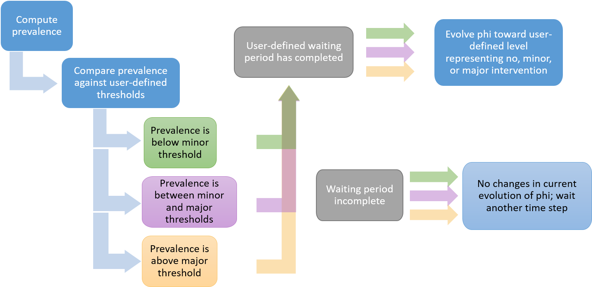

## Description of user-defined parameters in the Covid-19 scripts
#### Introduction
This set of R scripts was developed for local modeling of the COVID-19 disease in Benton County, Oregon, and other small geographies. The scripts use a modified SEIR model with partially-mixed, but otherwise homogeneous population nodes. This markdown document describes the user-defined function parameters for the covid scripts.

##### Acknowledgements:
I'd like to thank the developers of the SimInf package for writing the code that these scripts use and for assisting me in adapting their code to meet the requirements of COVID-19 modeling.  

Widgren S, Bauer P, Eriksson R, Engblom S (2019) SimInf: An R Package for Data-Driven Stochastic Disease Spread Simulations. Journal of Statistical Software, 91(12), 1--42. doi: 10.18637/jss.v091.i12  

Bauer P, Engblom S, Widgren S (2016) Fast event-based epidemiological simulations on national scales. International Journal of High Performance Computing Applications, 30(4), 438--453. doi: 10.1177/1094342016635723

[SimInf vignettes](https://cran.r-project.org/web/packages/SimInf/vignettes/SimInf.pdf)  
[SimInf technical documentation](https://cran.r-project.org/web/packages/SimInf/SimInf.pdf)  
[SimInf git repository](https://github.com/stewid/SimInf)

##### Conceptual schematic of SimInf

The conceptual schematic of the SimInf model that I use has three stages: Building the model, Running the model, and the Result.
##### Building the model:
- Specify the model with parameters for disease spread, population compartments, and transitions between compartments.
- Set the initial states in the compartments and the initial values of the continuous variables.
- (If the model used is not one of the built-in model) Write the post-time-step function that changes continuous variables after every time step.
- Generate a dataframe of events that can introduce or remove individuals to different compartments, transfer them between nodes, or shift them between compartments, at different times.
##### Run the model:
- Advance individuals through compartments using the transitions and disease parameters. Record the compartment counts and continous variable values for the disease trajectory.
- Use the events dataframe to move individuals in/out/between nodes and/or compartments.
- Advance the time step.
- Change continuous variables according to the post-time-step functions.
- Repeat for every time step.
##### Result:
- Trajectories of the compartments across the timespan.
- Evolution of continous variables across the timespan.
- With the result, you can plot trajectories for the different compartments and/or the evolutino of the continuous variables.

### covid19_SimInf_06.06.2020.R (or updated date) parameters
The covid19_SimInf_DATE.R script pre- and post-processes data and sets parameters to use in the SimInf model. The script has a number of pre-processing steps and associated parameters, which are discussed below. Parameters are organized in two ways - thematically with the model and logistically with the code. For example, a parameter may fit thematically with "disease dynamics" and logistically within the post-time-step function.  In this vignette, the parameters are organized thematically.
#### Simulation parameters
The script relies on subroutines that need to be accessed. Set the folder where they are stored using the `folderpath` argument. This folderpath is also where the exported graphs will be saved. The `simID` argument is the heading for the different graphs.  

The arguments `simDate` and `maxT` set the date parameters - when the simulation starts and how long it runs (in days).  

The argument `numTrials` sets the number of trials in the simulation. The script limits the number of trials to a maximum of 100 in order to keep runtime in check. This limit can be changed in the code itself.
#### Population parameters
The model assumes a homogenous, partially-mixed, mostly closed population. Homogenous because every individual has the same disease dynamics (chance of infection/dying, length of infectious period, etc.). Partially-mixed because the total population is divided into nodes. The disease evolves independently in different nodes, with occasional transfers between nodes to expose other nodes to disease. Mostly closed because no individuals leave the population except through death, and no individuals enter the population except for the occasional parachuting of infectious individuals or planned entry events.  

`trialPop` is the total population of initially susceptible individuals at time t.  

`N` is the number of nodes, limited to a maximum of 500 in the code. The node population is randomly generated with a mean population of approximately `0.8*trialPop/N`. The distribution is slightly skewed left. The maximum number of nodes and the distribution of the trial population can be changed in the code itself.  

`nodeGroupList` is an optional parameter to split the nodes into different groups. This represents subpopulations that are more likely to mix within the group compared to across groups. For example, distinct cities can be grouped into different nodeGroups. `nodeGroupList` is either `NULL` or a vector of length `N` with entries equal to the node group for each node.  

`unifPop` is a logical if the initial susceptible population is distributed uniformly or randomly between nodes.  

`I0Pop` through `M0Pop` are the initial populations of the non-susceptible compartments. All of these compartments except `I0Pop` are set to 0 by default.  

`maxINodeProp` sets an upper limit on how many nodes can have a positive initial infectious population, to represent that the disease is not evenly distributed. `I0nodeGroups` allows the distribution of initial infectious to be restricted to certain node groups.
#### Disease dynamics parameters
The disease dynamic parameters are split into three groups: global data (`gdata`), local data (`ldata`), and continuous variables (`v0`). Global data applies to all nodes and trials in the simulation. Local data can be specified to the individual trial, nodeGroup, or node. Neither global nor local data change during the simulation. Continuous variables can be specified locally, and can change during the simulation. You can change where parameters are specific in the code itself. For example, the default is for the basic reproduction number to be a global parameter, but you could make it a local parameter or a continuous variable. 
##### Global data parameters
```
R0I = 1.9,                               # Basic reproduction number for first infectiousPeriod days
R0P = .125,                              # Basic reproduction number for post infectious (after successful monitoring)
R0U = 1,                                 # Basic reproduction number for remaining infectious period if monitoring fails
initInfectiousPeriod = 1/4,              # Reciprocal of initial infectious period
postInfectiousPeriod = 1/10,             # Reciprocal of post-infectious period
unknownInfectiousPeriod = 1/6,           # Reciprocal of remaining, unknown-infectious period
exposedPeriod = 1/4,                     # Reciprocal of exposed period
isoRate = .125,                          # Proportion of exposed who are identified and isolated before they become infectious
monitoringSuccess = .25,                 # Proportion of infectious whose symptoms are identified and moved to post-infectious
hospRateExp = .033,                      # Proportion of isolated that are hospitalized - should match overall population hospitalization rate
hospRatePost = .16,                      # Proportion of successfully identified cases who are hospitalized - should match observed hospitalization rate
hospPeriod = 1/10,                       # Reciprocal of length of hospitalization period
nonHospDeathRate = 0,                    # Non-hospitalized fatality rate
hospDeathRate = .125,                    # Hospitalized fatality rate NOT CASE FATALITY RATE
reSuscepRate = .1,                       # Proportion of recovereds who eventually become susceptible again
tempImmPeriod = 1/100,                   # Reciprocal of temporary immunity period, after which R becomes Im or S
mu = 0,                                  # Natural birth/susceptible immigration rate
nu = 0,                                  # Natural non-Covid death rate
```
It is recommended to let `R0I+R0U` equal the overall reproduction number (e.g 2.9), but put more of the weight on `R0I` to represent higher infectiousness in the earlier period. Then set `R0P` sufficiently low to represent low transmissibility among isolated individuals.  

##### Local data parameters
` R0Spread = .1` is a parameter to generate a uniform distribution of R0 across different trials. `R0` is scaled by `[1-R0Spread,1+R0Spread].`
##### Continuous disease dynamics parameters
`phi` is a factor that scales `R0` to produce an effective reproduction number at different time steps. `phi` evolves in response to changes in the trial-wide prevalence of the disease. The mechanism is as follows:
  

`phi0` sets the initial value of `phi`.  

`cosAmp` sets the amplitude of the cosine function that scales R0 up or down, with a peak on February 1st and a trough on August 1st, under the assumption that the natural infectiousness of the coronavirus varies seasonally.  

#### Policy and physical distancing parameters
Different policy interventions (stay-at-home orders, limited business operations, etc.) correspond to different levels of phi, which in turn scale R0 to different values. For simplicity, all arguments are defined in terms of the resulting effective reproduction number.  

`RPhysicalDistancing` is the effective reproduction number when people practice individual physical distancing.  

`RNoAction` is the effective reproduction number with no actions of any kind. `RNoAction` defaults to `R0`.

`RTarget1` (`RTarget2`) is the targeted effective reproduction number under a minor (major) policy intervention.  

`maxPrev1` (`maxPrev2`) is the prevalence threshold before imposing or lifting a minor (major) policy intervention.

`upDelay` (`downDelay`) is the number of timesteps after the prevalence threshold is crossed before imposing (lifting) a policy intervention.  

`phiMoveUp` (`phiMoveDown`) is the rate at which phi converges exponentially to the new target when phi is increasing (decreasing).  

`pdDecay` is the number of days it takes for individual physical distancing to decay once prevalence is below the minor threshold. This represents people returning to normal interactions after they no longer feel the more obvious effects of policy interventions.  

In Oregon, the plans for reopening involve three phases. `kbDay1`, `kbDay2`, and `kbDay3` are the dates each phase is instituted. `kbPhase` is the initial phase of reopening at the start of the simulation.  

It may be helpful to compare the disease trajectories with or without the ability to use policy interventions. `switchOffPolicies` and `switchOffDay` control whether minor/major policies will be switched off permanently and when.
#### Event parameters
The covid script uses events to model different population dynamics.
- People are always entering a population. Some of those people may bring an infection with them. I call these individuals "parachuters". For simplicity, this model does not include people leaving the population. You can add to the code itself if desired.
- People tend to see the same people every day, but they occasionally move between nodes. These people may be in any of a number of compartments. These movements are captured with transfer events.
- There is a non-zero probability than an infectious person will be a super-spreader, who does not fit the normal R0 for generating new infections.
- There may be certain populations that undergo mass changes, like students returning to a college town, or military divisions shipping out. Because this model was built for a college community, a mass entry event is included. You can add to the code itself to represent a mass exit event.  
Each of these event types are generated according to parameters set by the user; but the event types can be overridden by the user.

##### Parachute events
I use a beta distribution for the parachuted infections. The default is uniform, but it can be changed with `paraMu` and `paraSig`. The built-in df generator is overridden if `!is.null(paraEventsDF)`   
```
paraEventsDF = NULL,                     # pre-built parachuter events data frame if the events will be preset before the script is run
paraMu = 1,                              # First shape parameter for beta function for timing of parachute events
paraSig = 1,                             # Second shape parameter for beta function for timing of parachute events
parachuteRate = 1/21,                    # Reciprocal of expected waiting time for a parachute event
parachuteNum = 1,                        # Number of infectious in each parachute event
parachuteNodeGroups = NULL,              # Which node groups the parachuters can land in
```  

#### Transfer events
People are more likely to transfer inside their node group compared to outside their node group. Change the following parameters to adjust the transfer dynamics. `transferEventsDF` is the preset. The various transfer parameters can be specified to each node group if desired, otherwise they are the same for each node group.
```
transferEventsDF = NULL,                 # pre-built transfer events data frame if the events will be preset before the script is run
inGroupTransferRate = 1/7               # Reciprocal of expected waiting time for in-transfer event
inGroupTransferNodeNum = .1             # Average number/proportion of nodes that transfer at each transfer event
inGroupTransferMinProp = .1             # Minimum proportion of node population that transfers in each event
inGroupTransferMaxProp = .3             # Maximum proportion of node population that transfers in each event
outGroupTransferRate = 1/15             # Reciprocal of expected waiting time for out-transfer event
outGroupTransferNodeNum = .05           # Average number/proportion of nodes that transfer at each transfer event
outGroupTransferMinProp = .05           # Minimum proportion of node population that transfers in each event
outGroupTransferMaxProp = .15           # Maximum proportion of node population that transfers in each event
```

#### Super spreader events
There may be zero, one, or more super spreader events at any given time step. The following parameters adjust the super spreader events. They are all lists to allow for multiple events.
```
superEventsDF = NULL,                    # pre-built super spreader events data frame if the events will be preset before the script is run
superInfections = c()          # Number of infections caused by the super spreader
superNodes = c()             # Number of nodes that the super spreader contacts
superNodeGroups = NULL       # Which node groups the super spreader contacts. Must use list() syntax for multiple events.
superDate = c()              # Date the super spreader lands. Date can also be numeric i.e. 200
superSpread = c()            # Symmetric spread in days of super spreader infections
```

#### Mass entry events
The following parameters adjust the mass entry events.
```
massEntryEventsDF = NULL,                # pre-built mass entry events data frame if the events will be preset before the script is run
massEntryReturnDate = "2020-09-21",      # Date of mass Entry
massEntryReturnSpread = 3,               # Symmetric spread of days to spread out mass entry
massEntryPop = 25000,                    # Mass entry population
maxMassEntryNodes = 0,                   # Maximum number of nodes that individuals enter. Set to 0 to remove massEntry event
massEntryNodeGroups = NULL,              # Which node groups the individuals enter
mSProp = .9,                             # Proportion of individuals who are susceptible
mEProp = .0001,                          # Proportion of individuals who are exposed
mIProp = .0015,                          # Proportion of individuals who are infectious; R, Im, and M are calculated
```

#### Plotting parameters
The script automatically plots 5 different sets of trajectories. These can be adjusted in the code itself. The script appropriately aggregates the different nodes within a given trial and can either plot the median and the confidence spread for the different number of trials, or all simulation trajectories. The following are parameters for the plots.
```
plotCompList = "I",                      # List of compartments that will be plotted
rollM = 1,                               # Number of days for plotting rolling means, rollM = 1 means no rolling mean
allTraj = FALSE,                         # Logical if all simulation trajectories are plotted or just median and spread
plotRandomTrajs = 0,                     # Number of randomly selected trajectories to superimpose on the plot, used when allTraj == TRUE
confIntv = .95,                          # two-sided confidence interval for plotting spread
plotGroups = NULL,                       # Which node groups to plot. NULL plots all
sumGroups = TRUE,                        # Whether to sum the node groups.
dateBreaks = "1 month",                  # Plot parameter, x-axis displays months
titleString = "Generic Title",           # Title of plot
xString = "Date",                        # Title of x-axis
yString = "Frequency",                   # Title of y-axis
lString = "Median",                      # Title of legend
cString = NULL                           # Plot caption
```

There is an option to separate nodes into different node groups. Then a subset of node groups can be plotted, and these can either sum nodes across all selected node groups, or to plot the different node group sums to compare different node groups.  

### Further reading
Read [02scriptNotes.md](02scriptNotes.md) for an explanation of the different steps in the script.
