## COVID-19 Vignettes - Policy Script
#### Introduction
This set of R scripts was developed for local modeling of the COVID-19 disease in Benton County, Oregon, and other small geographies. The scripts use a modified SEIR model with partially-mixed, but otherwise homogeneous population nodes. This markdown document presents a set of vignettes and explains the output.

##### Acknowledgements:
I'd like to thank the developers of the SimInf package for writing the code that these scripts use and for assisting me in adapting their code to meet the requirements of COVID-19 modeling.  

Widgren S, Bauer P, Eriksson R, Engblom S (2019) SimInf: An R Package for Data-Driven Stochastic Disease Spread Simulations. Journal of Statistical Software, 91(12), 1--42. doi: 10.18637/jss.v091.i12  

Bauer P, Engblom S, Widgren S (2016) Fast event-based epidemiological simulations on national scales. International Journal of High Performance Computing Applications, 30(4), 438--453. doi: 10.1177/1094342016635723

[SimInf vignettes](https://cran.r-project.org/web/packages/SimInf/vignettes/SimInf.pdf)  
[SimInf technical documentation](https://cran.r-project.org/web/packages/SimInf/SimInf.pdf)  
[SimInf git repository](https://github.com/stewid/SimInf)

##### Conceptual schematic of SimInf

The conceptual schematic of the SimInf model that I use has three stages: Building the model, Running the model, and the Result.
##### Building the model:
- Specify the model with parameters for disease spread, population compartments, and transitions between compartments.
- Set the initial states in the compartments and the initial values of the continuous variables.
- (If the model used is not one of the built-in model) Write the post-time-step function that changes continuous variables after every time step.
- Generate a dataframe of events that can introduce or remove individuals to different compartments, transfer them between nodes, or shift them between compartments, at different times.
##### Run the model:
- Advance individuals through compartments using the transitions and disease parameters. Record the compartment counts and continous variable values for the disease trajectory.
- Use the events dataframe to move individuals in/out/between nodes and/or compartments.
- Advance the time step.
- Change continuous variables according to the post-time-step functions.
- Repeat for every time step.
##### Result:
- Trajectories of the compartments across the timespan.
- Evolution of continous variables across the timespan.
- With the result, you can plot trajectories for the different compartments and/or the evolutino of the continuous variables.

#### Vignette 1: The basics
All of the arguments for the COVID-19 script (`covidWrapper`) are defaulted, so you can just run the script with no arguments:
```
r1 <- covidWrapper()
```

The output for `r1` is the model after it has been run:
```
Model: SimInf_model
Number of nodes: 50000
Number of transitions: 23
Number of scheduled events: 262445

Global data
-----------
 Parameter               Value    
 betaI                   0.4750000
 betaP                   0.0125000
 betaU                   0.1666667
 initInfectiousPeriod    0.2500000
 postInfectiousPeriod    0.1000000
 unknownInfectiousPeriod 0.1666667
 exposedPeriod           0.2500000
 monitoringSuccess       0.2500000
 isoRate                 0.1250000
 hospRateExp             0.0330000
 hospRatePost            0.1600000
 hospPeriod              0.1000000
 nonHospDeathRate        0.0000000
 hospDeathRate           0.1250000
 reSuscepRate            0.1000000
 tempImmPeriod           0.0100000
 mu                      0.0000000
 nu                      0.0000000

Local data
----------
                    Min.  1st Qu.   Median     Mean  3rd Qu.     Max.
 firstNode      0.00e+00 1.24e+04 2.48e+04 2.48e+04 3.71e+04 4.95e+04
 betaRandomizer 9.02e-01 9.49e-01 9.86e-01 9.93e-01 1.04e+00 1.09e+00

Continuous state variables
--------------------------
                   Min.  1st Qu.   Median     Mean  3rd Qu.     Max.
 phi           1.00e+00 1.00e+00 1.11e+00 1.46e+00 1.49e+00 3.22e+00
 prevUp01      0.00e+00 0.00e+00 0.00e+00 9.25e-01 1.00e+00 1.10e+01
 prevUp12      0.00e+00 0.00e+00 0.00e+00 2.72e-02 0.00e+00 1.10e+01
 prevDown21    0.00e+00 3.00e+01 3.00e+01 2.97e+01 3.00e+01 3.00e+01
 prevDown10    0.00e+00 2.90e+01 2.90e+01 2.86e+01 2.90e+01 2.90e+01
 kbPhase       0.00e+00 3.00e+00 3.00e+00 2.60e+00 3.00e+00 3.00e+00
 policy        1.00e+00 1.00e+00 1.00e+00 1.00e+00 1.00e+00 1.00e+00
 season        7.50e-01 8.26e-01 9.96e-01 1.00e+00 1.17e+00 1.25e+00
 prevalence    0.00e+00 1.67e-04 4.09e-04 4.65e-04 7.06e-04 2.16e-03
 previousState 0.00e+00 0.00e+00 0.00e+00 6.77e-02 0.00e+00 2.00e+00
 RTee          9.35e+00 2.07e+01 3.18e+01 3.03e+01 3.92e+01 5.20e+01
 pdCounter     0.00e+00 0.00e+00 3.00e+01 5.76e+01 9.20e+01 2.91e+02

Compartments
------------
          Min.  1st Qu.   Median     Mean  3rd Qu.     Max.
 S    0.00e+00 9.20e+01 1.25e+02 1.28e+02 1.56e+02 4.84e+02
 E    0.00e+00 0.00e+00 0.00e+00 6.80e-02 0.00e+00 5.30e+01
 I    0.00e+00 0.00e+00 0.00e+00 6.23e-02 0.00e+00 4.90e+01
 uI   0.00e+00 0.00e+00 0.00e+00 6.89e-02 0.00e+00 4.00e+01
 R    0.00e+00 0.00e+00 0.00e+00 1.11e+00 0.00e+00 2.26e+02
 Im   0.00e+00 0.00e+00 0.00e+00 1.24e+00 0.00e+00 1.97e+02
 pI   0.00e+00 0.00e+00 0.00e+00 5.16e-02 0.00e+00 3.50e+01
 H    0.00e+00 0.00e+00 0.00e+00 3.13e-03 0.00e+00 8.00e+00
 cumI 0.00e+00 0.00e+00 0.00e+00 2.72e+00 0.00e+00 3.37e+02
 M    0.00e+00 0.00e+00 0.00e+00 5.94e-02 0.00e+00 1.40e+01
 ```
From this model, you can extract compartment trajectories, continous variables, the events data frame, etc. Refer to the [SimInf Vignettes](https://cran.r-project.org/web/packages/SimInf/vignettes/SimInf.pdf) and the [SimInf technical documentation](https://cran.r-project.org/web/packages/SimInf/SimInf.pdf) for details.  

In addition to returning the model, the script saves all the parameters to a .txt file and plots 5 trajectories and saves them as .png files.
```
trajPlotInfections # Plot of daily active infections, computed by the sum of I, uI, pI, and H
trajPlotPhi        # Plot of phi, the intervention intensity continuous variable
trajPlotnewI       # Plot of daily new infections
trajPlotHosp       # Plot of daily hospitalizations
trajPlotDeaths     # Plot of cumulative deaths
```
###### Output: Plot of daily active infections:
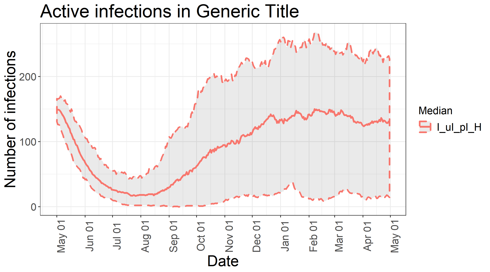
The simulation runs up to 100 trials. Each trial produces a trajectory. For simplicity the plot shows the median of each trajectory at each time step, rather than some central tendency of all the trials. The gray shaded area shows the user-defined credible spread (default = 90%), defined as the 5th percentile and the 95th percentile at each time step.  

###### Output: Plot of the intervention intensity:
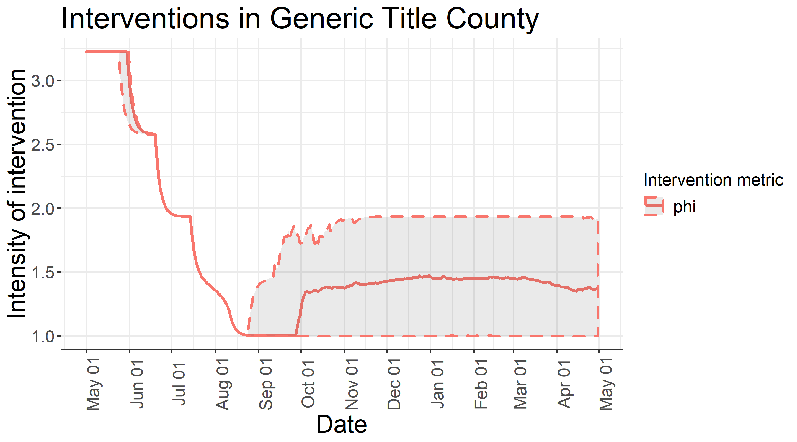
###### Interpretation the intervention intensity graph:  
The y-axis is the value of phi. Phi acts inversely on the transmissibility of the coronavirus (beta). `phi = 1.0` indicates no intervention. Phi changes as the observed prevalence of COVID-19 changes. Higher prevalence will start a higher-intensity intervention, after a user-defined delay. Instead of a discrete jump to the intervention, phi converges exponentially according to a user-defined parameter. The default parameters incorporate a phased re-opening in 3 phases from May 25th through July 15th 2020, which leads to the three-stepped shape. As with the infections graph, a credible spread is provided. Since the central tendency is the median at each time step, there may be sharp peaks around a more stable trend: read the sharp peaks as an artifact of the plotting procedure.  

There are three other plots produced in the script: Daily new infections, Daily active hospitalizations, and Cumulative deaths. These are interpreted similarly to the daily active infections.

#### Vignette 2: More mixing in the population
As the population becomes more mixed, any given infection has a larger pool of susceptibles into which it can spread. Under this model, this translates to a smaller number of larger epidemics, rather than a larger number of mini-epidemics. Overall, the number of infections is larger.  

To represent more mixing, you can decrease the number of nodes and/or increase the rate of transfers. To change the user defined parameters, just define them in the function call. 
```
r2 <- covidWrapper(simID="moreMixing",
             N = 5, # instead of N = 500
             inGroupTransferRate=1/3)
```
###### Output: Plot of daily active infections:
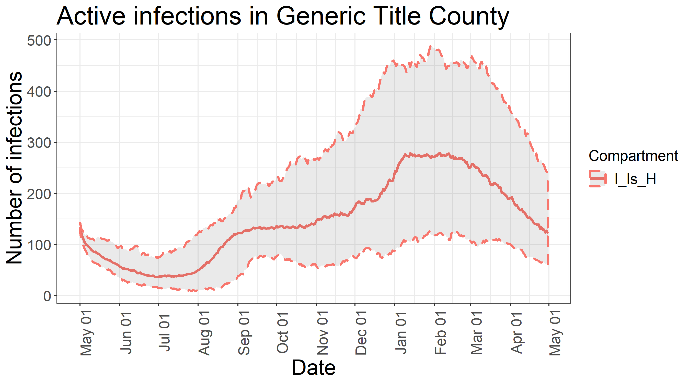

#### Vignette 3: Shocks to the system
The theorectical nature of the SEIR model does not allow for shocks to the system, like super-spreader events. But the script can model super-spread events or mass entry events to exogeneously force these shocks to the system.
```
r3 <- covidWrapper(simID="Shocks",
                   superInfections = c(100,50),              # Number of infections caused by the super spreader
                   superNodes = c(20,20),                    # Number of nodes that the super spreader contacts
                   superNodeGroups = NULL,                   # Which node groups the super spreader contacts. Must use list() syntax for multiple events
                   superDate = c("2020-10-01","2021-02-01"), # Date the super spreader lands. Date can also be numeric i.e. 200
                   superSpread = c(3,5)                      # Symmetric spread in days of super spreader infections)
)
```
###### Output: Plot of daily active infections:
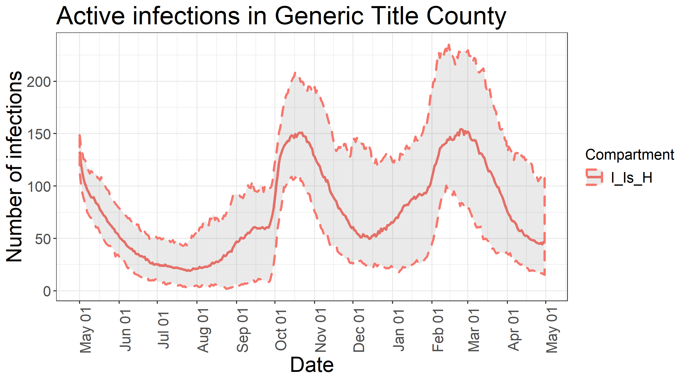
The infections plot shows the two super spreader events on 10/01/2020 and 02/01/2021. These can be further visualized in the daily new infections plot:
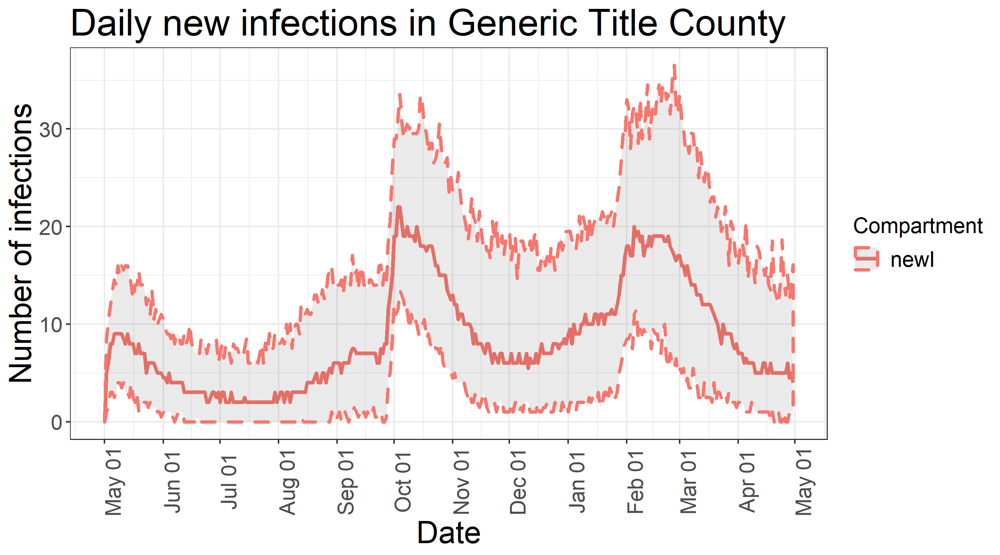
###### Output: Plot of intervention intensity:
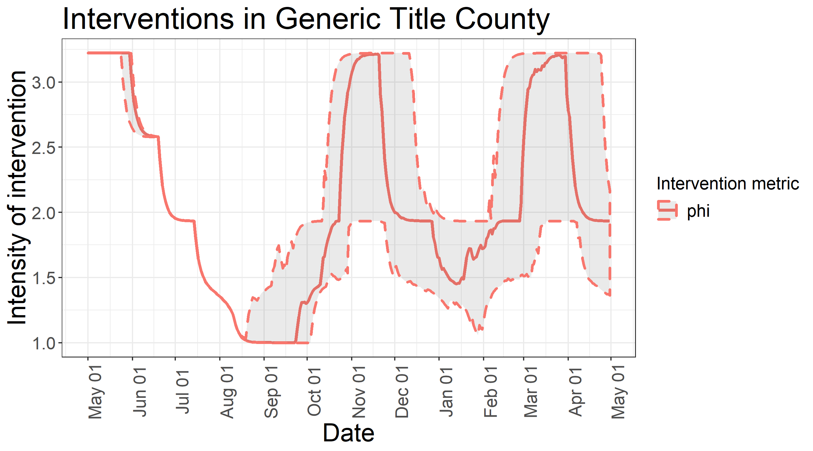
The intervention plot demonstrates the internal response to the increased prevalence.

#### Vignette 4: Changing policy interventions
The script can change the policy interventions in a number of ways:
- The intervention intensity of the moderate/major policy.
- The prevalence threshold at which the intervention is imposed/lifted, either count or proportion.
- The speed at which phi converges to the new level.
- The delay before phi starts to change, both as an intervention is imposed and as it is lifted.
- The rate at which physical distancing decays once all interventions are lifted, and the level of phi under physical distancing.
- To explore counterfactuals, the script can turn off interventions at a user-defined date.

Depending on the epidemic pressure, these changes may or may not be apparent in the trajectories. For this vignette, the super-spreader events are included to shock the system into responding.
```
r4 <- covidWrapper(simID="Interventions",
                   superInfections = c(100,50),              # Number of infections caused by the super spreader
                   superNodes = c(20,20),                    # Number of nodes that the super spreader contacts
                   superNodeGroups = NULL,                   # Which node groups the super spreader contacts. Must use list() syntax for multiple events
                   superDate = c("2020-10-01","2021-02-01"), # Date the super spreader lands. Date can also be numeric i.e. 200
                   superSpread = c(3,5),                     # Symmetric spread in days of super spreader infections)
                   RPhysicalDistancing = 2.2,                # Ongoing baseline Rt, reflecting that physical distancing and contact tracing will reduce R0 even without stay-at-home orders
                   RTarget1 = 1.75,                          # Target for the reduction in R under minor intervention
                   RTarget2 = .7,                            # Target for the reduction in R under major intervention
                   maxPrev1 = .0015,                         # Maximum prevalence before instituting minor intervention
                   maxPrev2 = .003,                          # Maximum prevalence before instituting major intervention
                   upDelay = 20,                             # Number of days after prevalence passes threshold until minor/major intervention
                   downDelay = 35,                           # Number of days after prevalence drops below threshold until intervention lifted
                   phiMoveUp = .15,                          # Rate at which phi increases when interventions are imposed
                   phiMoveDown = .5,                         # Rate at which phi decreases when interventions are lifted
                   pdDecay = 10,                             # Number of days until RPhysicalDistancing decays toward RNoAction in the absence of interventions.
                   switchOffPolicies = 1,                    # Indicator if intervention policies will cease after a certain day
                   switchOffDay = "2020-12-31"               # Date intervention policies will cease if indicator == 1
)
```
###### Output: Plot of daily active infections:
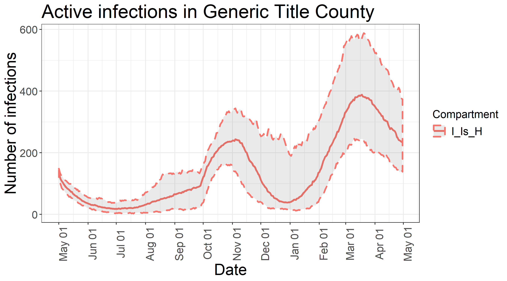
The shape of the trajectory is similar to vignette 3 up until the policy interventions are switched off; then the second super spreader creates a wave that burns through without control.
###### Output: Plot of intervention intensity:
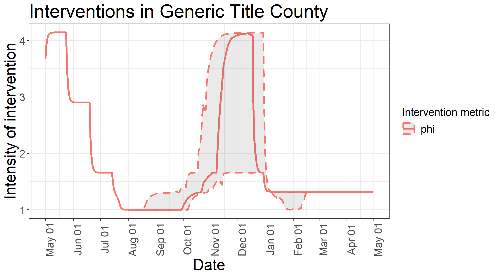
The movement of phi is a little slower since the delays, the jumps up are flatter since phiMoveUp has been increased and the jumps down are sharper since phiMoveDown has been increased. The policies switch off on 12/31/2020, leaving only physical distancing to increase phi above the 1.0 baseline.

#### Vignette 5: Disease parameters
Most of these parameters affect the dynamics in ways that are similar to other SEIR models. The few that have a big difference are included in this vignette.
```
r5 <- covidWrapper(simID="DiseaseDynamics",
                   hospRate = .033,                        # Proportion of infectious/isolated that are hospitalized
                   hospDeathRate = .35,                    # Hospitalized fatality rate NOT CASE FATALITY RATE
                   cosAmp = 0.25                           # Amplitude of seasonal variation in beta
)
```
###### Output: Plot of daily active infections:
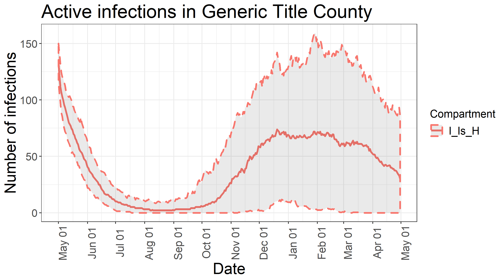
The increased seasonality causes more epidemic pressure in the winter and less in the summer.

###### Output: Plot of cumulative death rate:
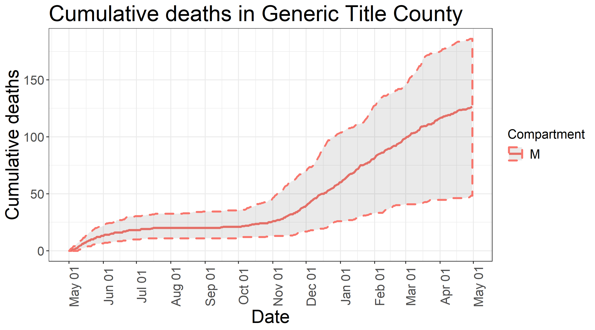
The increased hospitalization and hospital death rate causes increased mortality. The increased hospitalization rate slows the spread a little bit, but not enough to have a big effect on the overall dynamics.

#### Vignette 5: Node Groups
The nodes in a simulation can be grouped to represent populations that are more likely to mix within a group than between groups. Parachuting infections, mass entry, and super spreader events can be directed to selected node groups. The trajectories can be plotted for the sum of all nodes in a simulation, the sum of all nodes in a subset of groups, or for the sum of each group separately.
```
r6 <- covidWrapper(simID="NodeGroups",
                   nodeGroupList = c(rep(1,200),rep(2,150),rep(3,100),rep(4,50)), # List of group IDs for node groups. Default is 1 group of nodes.
                   parachuteNodeGroups = c(1,2),             # Which nodes groups the parachuters can land in
                   superInfections = c(100,50),              # Number of infections caused by the super spreader
                   superNodes = c(20,20),                    # Number of nodes that the super spreader contacts
                   superNodeGroups = c(3,4),                 # Which node groups the super spreader contacts. Must use list() syntax for multiple events
                   superDate = c("2020-10-01","2021-02-01"), # Date the super spreader lands. Date can also be numeric i.e. 200
                   superSpread = c(3,5),                     # Symmetric spread in days of super spreader infections
                   plotGroups = c(1,3),                      # Which node groups to plot
                   plotSum = FALSE,                          # Whether to sum across all node groups or sum them separately
                   lString = "Node Group"                    # Title of legend
)
```
###### Output: Plot of active daily infections by node group:
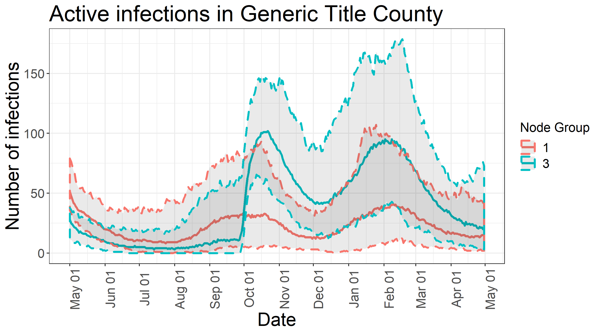  

#### Vignette 6: All simulation trajectories.
Thanks to [Jae S Choi](https://github.com/jae0/adapt) for the design of these plots. I liked the way they looked so I developed something similar for my code.
Suppose that instead of ploting the point-in-time median and spread of the simulation trajectories, you want to plot all trajectories. You can use the following code:
```
r7 <- covidWrapper(simID="allTraj",
                   allTraj = TRUE,
                   plotRandomTrajs = 5)
```
###### Output: Plot of active daily infections, all trajectories:
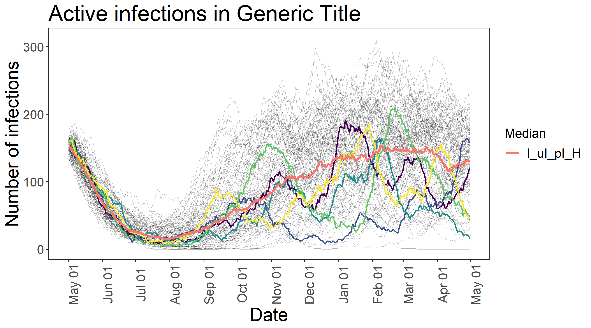

Each trajectory is plotted as a thin black line, with some transperncy. The most common trajectories overlap to shade the highest likelihood areas darker. In order to pick out some example trajectories, the user can select how many random trajectories to superimpose to on the plot, and the point-in-time median is again plotted by default. Showing all the trajectories can be a little overwhelming, but it does make it clear that the point-in-time median and gray ribbon in the other plot conceals a lot of variation.
